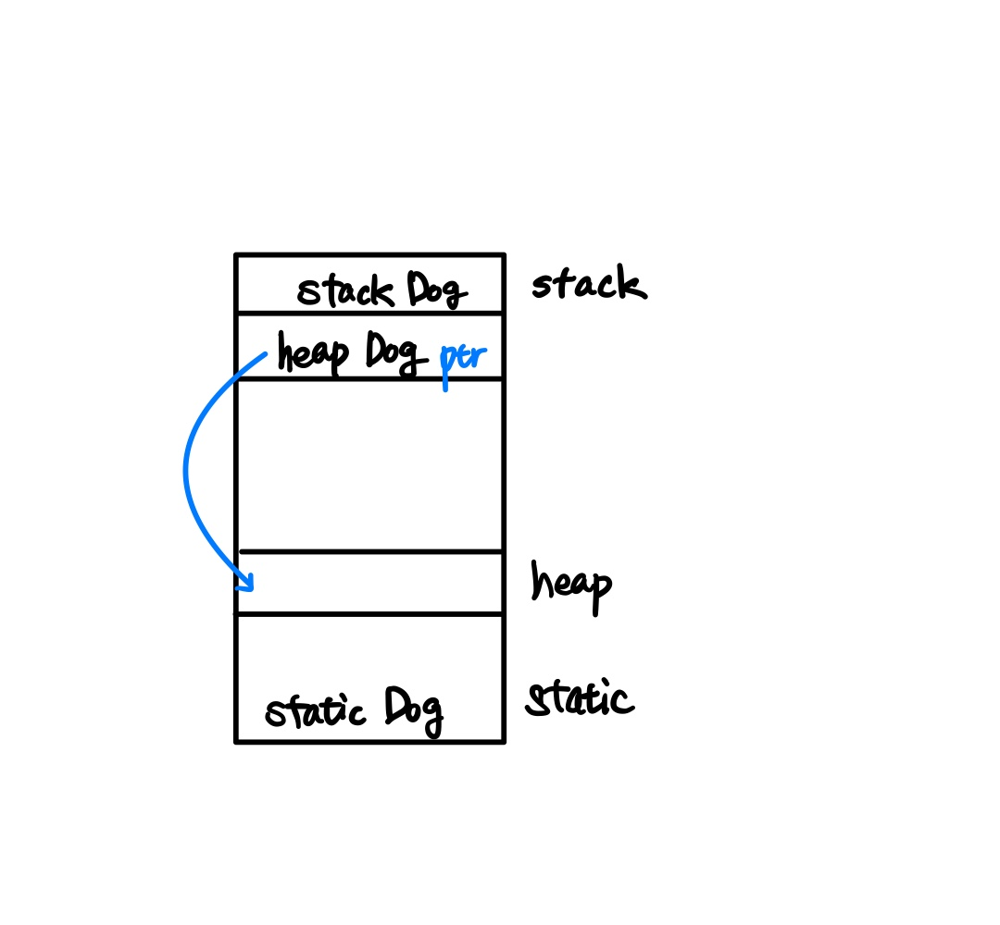
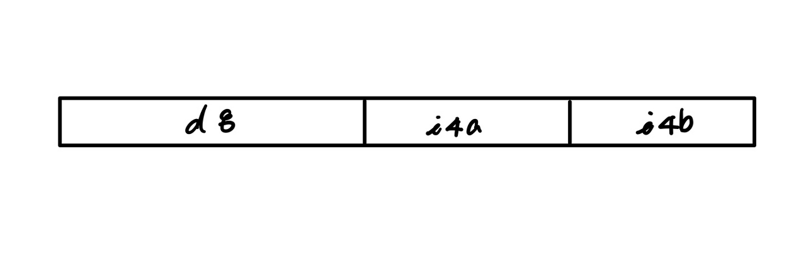
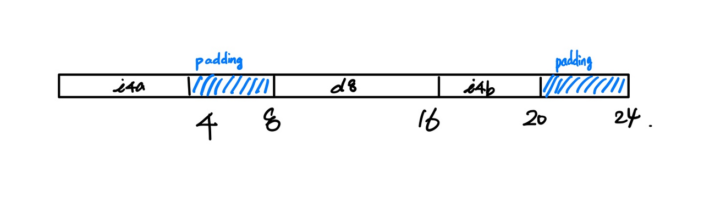
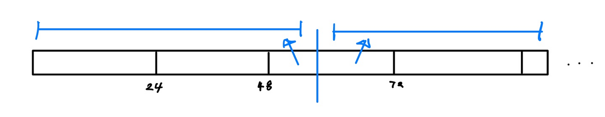

C++ 에는 OOP 패러다임을 적용한 언어이기 때문에 클래스가 존재한다. 본 포스팅은 **데이터 얼라인먼트**에 대해서 얘기해본다.

먼저 객체를 생성하는 방법은 크게 3가지이다. stack메모리에 객체를 생성하는 방법, heap메모리에 동적으로 생성하는 방법과 static 하게 객체를 생성하는 방법이 있다.

```
#include <iostream>

class Dog
{
public:
	void speak()
	{
		std::cout << "woof" << '\n';
	}
private:
	int i4a;
};

Dog staticDog;	//static

int main()
{
	Dog stackDog;	//stack
    
	Dog* heapDog = new Dog;	//heap
	
	delete heapDog;
	return 0;
}
```

위 코드 main함수를 보게 되면 Dog stackDog가 있다. 해당 객체는 stack영역에 저장이 된다. 다음은 Dog\* heapDog는 포인터이다.  
stack영역에 포인터를 생성하고 heap영역에 객체를 생성한 뒤 포인터가 heap영역의 객체를 가리키는 식으로 메모리가 할당이 된다.  
마지막으로 Dog staticDog는 static메모리 공간에 할당이 된다.  

<p align="center">

</p>
이어서 클래스 혹은 구조체의 Memory Alignment에 대해서 설명한다.  

Memory Alignment는 메모리가 할당이 어떤 식으로 할당이 되는지에 대한 룰이다. 구조체의 멤버 변수들의 자료형의 크기에 따라 메모리를 할당을 어떻게 해줄까에 대한 얘기이다. 예를 들어서 얘기해보자.


## Case 1

```
class Dog
{
public:
	void speak()
	{
		std::cout << "woof" << '\n';
	}
private:
	double d8;
	int i4a;
	int i4b;
};
```

main함수에서 sizeof() 연산자로 해당 클래스의 크기를 출력을 해본 결과 16바이트의 크기를 가지고 있다. 이는 자명하다. 간단하게 메모리에 대한 그림으로 나타내면 아래와 같다. 

<p align="center">

</p>

**\*char형 자료현은 1바이트, int 자료형 4바이트, double자료형은 8바이트로 가정한다. 이는 환경마다 다르기 때문이다.**

double은 8바이트 두 개의 int는 8바이트 이기 때문에 더하면 16바이트라는 답을 쉽게 얻을 수 있다. 

<br/>
## Case 2

```
class Dog
{
public:
	void speak()
	{
		std::cout << "woof" << '\n';
	}
private:
	int i4a;
	double d8;
	int i4b;
};
```

이번에는 double형 d8을 int형 멤버 변수 사이에 위치하였다.  
해당 케이스도 main함수에서 sizeof() 연산자를 통해 크기를 출력해본 결과 **24바이트로 출력**이 됐다. **왜 그런 걸까? **

이는 Memory Alignment의 두 가지 특징 때문에 일어난 일이다. 

# Memory Alignment의 두 가지 특징

-   멤버 변수는 해당 변수의 자료형 크기의 배수 위치에서 시작해야 된다. 
-   오브젝트의 전체 사이즈는 가장 큰 멤버 변수의 크기의 배수에서 끝나야 한다. 

<p align="center">

</p>

int형 멤버 변수 i4a는 정상적으로 4바이트 공간을 할당을 받았다.  
그다음 멤버 변수인 d8을 할당하려고 했으나 할당하려는 위치가 double형 멤버 변수의 크기인 8의 배수가 아니기 때문에 자동적으로 **Memory Padding**이 일어나 4바이트를 placehold (빈 공간) 채워준다.  
이제 시작 위지 차 8이기 때문에 정상적으로 d8을 할당하였다.  
그다음 16바이트 위치는 i4b의 자료형이 int이기 때문에 4의 배수가 성립이 되어 할당을 해준다.  
마지막으로 Memory Alignment의 특징인 오브젝트의 전체 사이즈는 가장 큰 멤버 변수의 크기의 배수로 끝나야 한다는 특징이 있기 때문에 가장 큰 멤버 변수는 double형 즉, 8바이트의 배수로 끝나야 하기 때문에 4바이트를 Padding을 더해주어 마지막으로 24바이트로 끝이 난다는 것을 확인할 수 있다.  

<br/>
# Cache line

나중에 다른 포스트에서 자세히 다룰 예정이지만 간단히 공부한 내용을 정리해보자면 **프로세서는 정보를 처리할 때 cache line을 이용하여 데이터를 끊어서 처리**를 하게 되는데 이 끊어지는 크기가 대체적으로 64바이트라고 한다. 그렇다면 아래 코드를 보자.

```
class Dog
{
public:
	void speak()
	{
		std::cout << "woof" << '\n';
	}
private:
	int i4a;
	double d8;
	int i4b;
};


int main()
{
	Dog DogArr[10];
	
	return 0;
}
```

 크기가 10인 Dog 객체 배열을 만들면 메모리는 아래와 같이 할당될 것이다. 

<p align="center">

</p>

배열에 담긴 10개의 객체들이 연이어 메모리를 할당받게 되지만 cache line이 데이터를 처리하기 위해선 cache line으로 잘라서 처리를 하게 된다.  
이 과정에서 3번째 객체는 사진과 같이 2조각으로 나누어 처리를 하게 된다.  
이런 형상은 False Sharing이라고 한다. 이러한 불상사를 예방하기 위해 이와 같이 코드를 짤 수 있다. 

```
class alignas(32) Dog
{
public:
	void speak()
	{
		std::cout << "woof" << '\n';
	}
private:
	int i4a;
	double d8;
	int i4b;
};


int main()
{
	Dog DogArr[10];
	
	return 0;
}
```

alignas(32)를 축가 해줌으로 각 객체의 메모리가 32바이트로 할당이 되고 원래 24바이트에서 추가된 8바이트는 Padding으로 채워지게 된다.  

<br/>
Ref.

[https://nocodeprogram.com/lecture/1/94892/](https://nocodeprogram.com/lecture/1/94892/)

